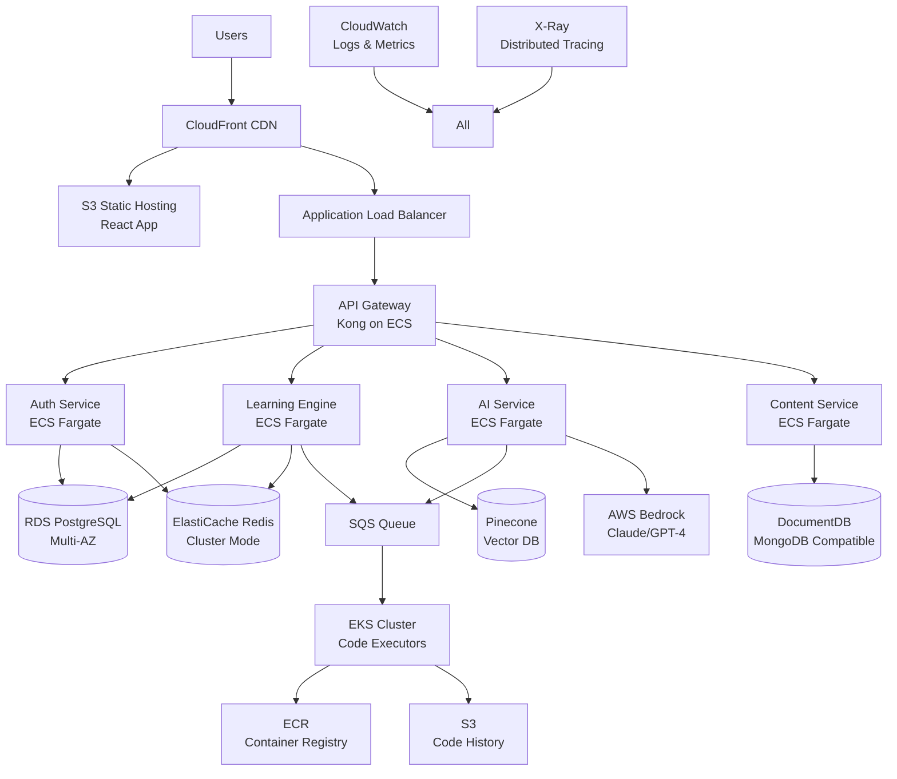
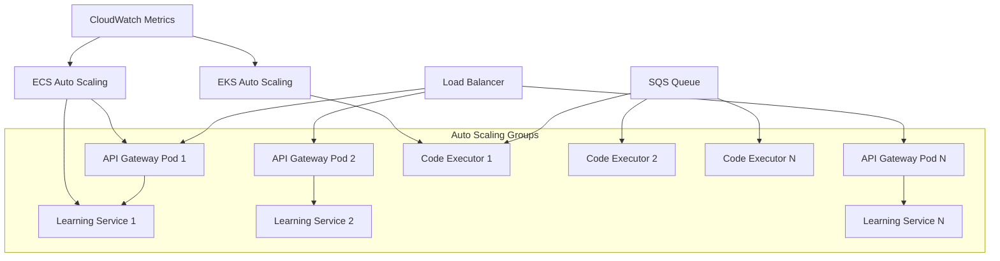
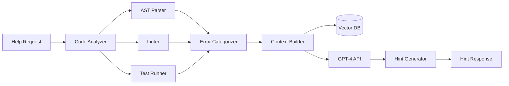
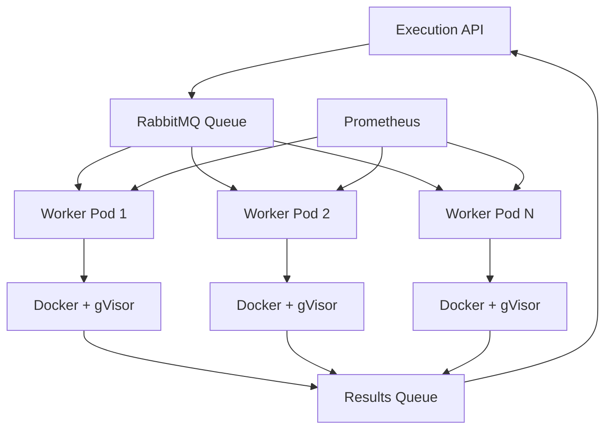

# Design Document: AI Coding Tutor

## Overview

The AI Coding Tutor is a distributed web-based learning platform implementing adaptive learning algorithms, LLM-powered code analysis, and real-time code execution in isolated containers. The system follows a microservices architecture with event-driven communication, horizontal scalability, and strong consistency guarantees for user progress data.

**Technical Stack:**
- Frontend: React 18+ with TypeScript, Monaco Editor for code editing, WebSocket for real-time updates
- API Gateway: Kong or AWS API Gateway with JWT authentication
- Backend Services: Node.js/TypeScript or Python/FastAPI microservices
- AI Service: Python with LangChain, OpenAI GPT-4 API, vector embeddings for context retrieval
- Code Execution: Docker containers with gVisor for enhanced isolation, Kubernetes for orchestration
- Message Queue: RabbitMQ or AWS SQS for async processing
- Cache: Redis for session data, leaderboards, and frequently accessed content
- Database: PostgreSQL for relational data, MongoDB for exercise content and code submissions
- Monitoring: Prometheus + Grafana for metrics, ELK stack for logging

**Architecture Principles:**
- Microservices communicate via REST APIs and message queues
- Event sourcing for user progress to enable audit trails and replay
- CQRS pattern for separating read and write operations on progress data
- Circuit breakers and retry logic for resilience
- Rate limiting per user and per service
- Horizontal pod autoscaling based on CPU and queue depth

## Architecture

### High-Level Architecture (AWS Deployment)



### AWS Service Mapping

**Compute:**
- ECS Fargate: Stateless microservices (Auth, Learning, AI, Content)
- EKS: Code execution workers (requires privileged containers for Docker-in-Docker)
- Lambda: Scheduled tasks (weekly reports, cleanup jobs)

**Storage:**
- RDS PostgreSQL Multi-AZ: User data, progress, sessions (read replicas for queries)
- DocumentDB: Exercise content, skill trees
- ElastiCache Redis Cluster: Sessions, leaderboards, rate limiting
- S3: Static assets, code submission history, exercise attachments
- EFS: Shared storage for EKS pods (if needed)

**Networking:**
- CloudFront: CDN for static assets and API caching
- ALB: Load balancing with path-based routing
- VPC: Private subnets for services, public subnets for ALB
- NAT Gateway: Outbound internet access for private subnets
- VPC Endpoints: S3, DynamoDB, SQS (reduce NAT costs)

**Messaging:**
- SQS: Code execution queue, async AI processing
- SNS: Notifications, alerts
- EventBridge: Scheduled events, cross-service events

**Security:**
- Secrets Manager: Database credentials, API keys
- KMS: Encryption keys for data at rest
- WAF: Web application firewall on CloudFront/ALB
- Security Groups: Network-level access control
- IAM: Service-to-service authentication

**Monitoring:**
- CloudWatch: Logs, metrics, alarms
- X-Ray: Distributed tracing
- CloudWatch Insights: Log analysis
- CloudWatch Synthetics: Uptime monitoring

### Scalability Architecture

**Horizontal Scaling:**



**Scaling Policies:**

```yaml
# ECS Service Auto Scaling
AutoScalingPolicy:
  TargetTrackingScaling:
    # Scale based on CPU utilization
    - MetricType: ECSServiceAverageCPUUtilization
      TargetValue: 70
      ScaleInCooldown: 300
      ScaleOutCooldown: 60
    
    # Scale based on memory utilization
    - MetricType: ECSServiceAverageMemoryUtilization
      TargetValue: 80
      ScaleInCooldown: 300
      ScaleOutCooldown: 60
    
    # Scale based on request count
    - MetricType: ALBRequestCountPerTarget
      TargetValue: 1000
      ScaleInCooldown: 300
      ScaleOutCooldown: 60
  
  MinCapacity: 2
  MaxCapacity: 50
  
# EKS Cluster Auto Scaling (Karpenter)
KarpenterProvisioner:
  Requirements:
    - key: karpenter.sh/capacity-type
      operator: In
      values: ["spot", "on-demand"]
    - key: kubernetes.io/arch
      operator: In
      values: ["amd64"]
  Limits:
    cpu: 1000
    memory: 1000Gi
  TTLSecondsAfterEmpty: 30
  TTLSecondsUntilExpired: 604800  # 7 days
```

**Database Scaling:**

```yaml
# RDS PostgreSQL
RDS:
  InstanceClass: db.r6g.2xlarge  # Start size
  MultiAZ: true
  ReadReplicas:
    - Region: us-east-1
      Count: 2
      InstanceClass: db.r6g.xlarge
  AutoScaling:
    MinCapacity: 2
    MaxCapacity: 15
    TargetCPU: 70
    TargetConnections: 500
  
  # Connection pooling with PgBouncer
  ConnectionPooling:
    MaxConnections: 1000
    PoolMode: transaction
    DefaultPoolSize: 25

# ElastiCache Redis
ElastiCache:
  NodeType: cache.r6g.xlarge
  NumCacheNodes: 3
  ClusterMode: enabled
  NumShards: 3
  ReplicasPerShard: 2
  AutoScaling:
    MinShards: 3
    MaxShards: 15
    TargetCPU: 70
    TargetMemory: 80
```

**Caching Strategy:**

```
Layer 1: CloudFront (Edge Caching)
- Static assets: 1 year TTL
- API responses (GET): 5 minute TTL
- Invalidation on content updates

Layer 2: Application Cache (Redis)
- Exercise content: 1 hour TTL
- Skill trees: 1 hour TTL
- Leaderboards: 5 minute TTL
- User sessions: 15 minute TTL
- Hint cache: 1 hour TTL

Layer 3: Database Query Cache
- PostgreSQL query cache
- Read replica for heavy queries
- Materialized views for analytics

Cache Invalidation:
- Event-driven invalidation via SNS
- Time-based expiration
- Manual invalidation API
```

**Load Distribution:**

```python
# Geographic distribution
Regions = {
    "us-east-1": {  # Primary
        "services": ["all"],
        "databases": ["primary"],
        "traffic_percentage": 60
    },
    "us-west-2": {  # Secondary
        "services": ["all"],
        "databases": ["read_replica"],
        "traffic_percentage": 25
    },
    "eu-west-1": {  # Europe
        "services": ["all"],
        "databases": ["read_replica"],
        "traffic_percentage": 15
    }
}

# Route 53 routing policy
Route53:
  RoutingPolicy: Geolocation
  HealthChecks:
    Interval: 30
    FailureThreshold: 3
  Failover:
    Primary: us-east-1
    Secondary: us-west-2
```

**Queue-Based Load Leveling:**

```python
# Code execution queue configuration
class QueueConfig:
    # Standard queue for normal priority
    STANDARD_QUEUE = {
        "name": "code-execution-standard",
        "visibility_timeout": 30,
        "message_retention": 3600,
        "max_receives": 3,
        "dead_letter_queue": "code-execution-dlq"
    }
    
    # Priority queue for paid users
    PRIORITY_QUEUE = {
        "name": "code-execution-priority",
        "visibility_timeout": 30,
        "message_retention": 3600,
        "max_receives": 3,
        "dead_letter_queue": "code-execution-dlq"
    }
    
    # Worker scaling based on queue depth
    SCALING_POLICY = {
        "metric": "ApproximateNumberOfMessagesVisible",
        "target_value": 100,  # Messages per worker
        "scale_out_cooldown": 60,
        "scale_in_cooldown": 300
    }

# Worker pool management
class WorkerPool:
    def __init__(self):
        self.min_workers = 5
        self.max_workers = 100
        self.current_workers = self.min_workers
    
    def scale_decision(self, queue_depth: int) -> int:
        """Calculate optimal worker count"""
        target_workers = math.ceil(queue_depth / 100)
        target_workers = max(self.min_workers, min(target_workers, self.max_workers))
        return target_workers
```

**Database Sharding Strategy:**

```python
# Shard by learner_id for horizontal scaling
class ShardRouter:
    def __init__(self, num_shards: int = 4):
        self.num_shards = num_shards
        self.shards = [
            f"rds-shard-{i}.cluster-xxx.us-east-1.rds.amazonaws.com"
            for i in range(num_shards)
        ]
    
    def get_shard(self, learner_id: str) -> str:
        """Route learner to consistent shard"""
        shard_id = int(hashlib.md5(learner_id.encode()).hexdigest(), 16) % self.num_shards
        return self.shards[shard_id]
    
    def get_all_shards(self) -> List[str]:
        """For queries that need to fan out"""
        return self.shards

# Shard-aware query execution
class ShardedQuery:
    def __init__(self, router: ShardRouter):
        self.router = router
    
    async def query_single_learner(self, learner_id: str, query: str):
        """Query single shard"""
        shard = self.router.get_shard(learner_id)
        return await self.execute_on_shard(shard, query)
    
    async def query_all_learners(self, query: str):
        """Fan out to all shards and aggregate"""
        tasks = [
            self.execute_on_shard(shard, query)
            for shard in self.router.get_all_shards()
        ]
        results = await asyncio.gather(*tasks)
        return self.aggregate_results(results)
```

**Rate Limiting & Throttling:**

```python
from redis import Redis
import time

class RateLimiter:
    def __init__(self, redis: Redis):
        self.redis = redis
        
        # Rate limits by tier
        self.limits = {
            "free": {
                "requests_per_minute": 60,
                "code_executions_per_hour": 100,
                "ai_hints_per_hour": 20
            },
            "premium": {
                "requests_per_minute": 300,
                "code_executions_per_hour": 1000,
                "ai_hints_per_hour": 200
            }
        }
    
    def check_rate_limit(
        self,
        learner_id: str,
        tier: str,
        action: str
    ) -> tuple[bool, int]:
        """
        Check if action is allowed under rate limit
        Returns: (allowed, retry_after_seconds)
        """
        limit_key = f"rate_limit:{learner_id}:{action}"
        
        # Get limit configuration
        if action == "api_request":
            limit = self.limits[tier]["requests_per_minute"]
            window = 60
        elif action == "code_execution":
            limit = self.limits[tier]["code_executions_per_hour"]
            window = 3600
        elif action == "ai_hint":
            limit = self.limits[tier]["ai_hints_per_hour"]
            window = 3600
        else:
            return True, 0
        
        # Sliding window counter
        now = time.time()
        window_start = now - window
        
        # Remove old entries
        self.redis.zremrangebyscore(limit_key, 0, window_start)
        
        # Count requests in window
        current_count = self.redis.zcard(limit_key)
        
        if current_count >= limit:
            # Get oldest entry to calculate retry time
            oldest = self.redis.zrange(limit_key, 0, 0, withscores=True)
            if oldest:
                retry_after = int(oldest[0][1] + window - now)
                return False, retry_after
            return False, window
        
        # Add current request
        self.redis.zadd(limit_key, {str(now): now})
        self.redis.expire(limit_key, window)
        
        return True, 0

# API Gateway rate limiting middleware
@app.middleware("http")
async def rate_limit_middleware(request: Request, call_next):
    learner_id = request.state.learner_id
    tier = request.state.tier
    
    allowed, retry_after = rate_limiter.check_rate_limit(
        learner_id,
        tier,
        "api_request"
    )
    
    if not allowed:
        return JSONResponse(
            status_code=429,
            content={"error": "Rate limit exceeded", "retry_after": retry_after},
            headers={"Retry-After": str(retry_after)}
        )
    
    response = await call_next(request)
    return response
```

**Circuit Breaker Pattern:**

```python
from enum import Enum
import time

class CircuitState(Enum):
    CLOSED = "closed"  # Normal operation
    OPEN = "open"      # Failing, reject requests
    HALF_OPEN = "half_open"  # Testing if service recovered

class CircuitBreaker:
    def __init__(
        self,
        failure_threshold: int = 5,
        timeout: int = 60,
        expected_exception: type = Exception
    ):
        self.failure_threshold = failure_threshold
        self.timeout = timeout
        self.expected_exception = expected_exception
        
        self.failure_count = 0
        self.last_failure_time = None
        self.state = CircuitState.CLOSED
    
    def call(self, func, *args, **kwargs):
        """Execute function with circuit breaker protection"""
        if self.state == CircuitState.OPEN:
            if time.time() - self.last_failure_time > self.timeout:
                self.state = CircuitState.HALF_OPEN
            else:
                raise Exception("Circuit breaker is OPEN")
        
        try:
            result = func(*args, **kwargs)
            self.on_success()
            return result
        except self.expected_exception as e:
            self.on_failure()
            raise e
    
    def on_success(self):
        """Reset on successful call"""
        self.failure_count = 0
        if self.state == CircuitState.HALF_OPEN:
            self.state = CircuitState.CLOSED
    
    def on_failure(self):
        """Increment failure count"""
        self.failure_count += 1
        self.last_failure_time = time.time()
        
        if self.failure_count >= self.failure_threshold:
            self.state = CircuitState.OPEN

# Usage with external services
ai_service_breaker = CircuitBreaker(failure_threshold=5, timeout=60)

def call_ai_service(prompt: str) -> str:
    return ai_service_breaker.call(
        openai.ChatCompletion.create,
        model="gpt-4",
        messages=[{"role": "user", "content": prompt}]
    )
```

**Performance Targets:**

```yaml
SLAs:
  Availability: 99.9%  # ~43 minutes downtime per month
  
  Latency:
    API_Response_p50: 100ms
    API_Response_p95: 300ms
    API_Response_p99: 500ms
    
    Code_Execution_p50: 2s
    Code_Execution_p95: 5s
    Code_Execution_p99: 8s
    
    AI_Hint_Generation_p50: 3s
    AI_Hint_Generation_p95: 8s
    AI_Hint_Generation_p99: 15s
  
  Throughput:
    API_Requests: 10000 req/sec
    Code_Executions: 1000 exec/sec
    Concurrent_Users: 100000
  
  Data:
    Database_Query_p95: 50ms
    Cache_Hit_Rate: 85%
    Data_Replication_Lag: <1s
```

**Cost Optimization:**

```python
# Spot instance strategy for code executors
class SpotInstanceStrategy:
    def __init__(self):
        self.on_demand_percentage = 20  # Minimum on-demand for stability
        self.spot_percentage = 80
        
        # Diversify across instance types
        self.instance_types = [
            "c6i.xlarge",
            "c6a.xlarge",
            "c5.xlarge",
            "c5a.xlarge"
        ]
        
        # Diversify across availability zones
        self.availability_zones = ["us-east-1a", "us-east-1b", "us-east-1c"]
    
    def get_capacity_config(self, desired_capacity: int):
        """Generate mixed instance policy"""
        on_demand_count = int(desired_capacity * self.on_demand_percentage / 100)
        spot_count = desired_capacity - on_demand_count
        
        return {
            "on_demand": {
                "count": on_demand_count,
                "instance_types": self.instance_types[:2]
            },
            "spot": {
                "count": spot_count,
                "instance_types": self.instance_types,
                "allocation_strategy": "capacity-optimized",
                "max_price": "0.10"  # Per hour
            }
        }

# S3 lifecycle policies for cost savings
S3LifecyclePolicy:
  Rules:
    - Id: TransitionOldSubmissions
      Status: Enabled
      Transitions:
        - Days: 30
          StorageClass: STANDARD_IA
        - Days: 90
          StorageClass: GLACIER
      Expiration:
        Days: 365
    
    - Id: DeleteOldLogs
      Status: Enabled
      Expiration:
        Days: 90
      Prefix: logs/

# Reserved capacity for predictable workloads
ReservedCapacity:
  RDS:
    InstanceClass: db.r6g.2xlarge
    Count: 2
    Term: 1year
    PaymentOption: PartialUpfront
    EstimatedSavings: 40%
  
  ElastiCache:
    NodeType: cache.r6g.xlarge
    Count: 3
    Term: 1year
    PaymentOption: PartialUpfront
    EstimatedSavings: 45%
```

### Service Responsibilities

**API Gateway (Kong)**
- Request routing with path-based and header-based rules
- JWT validation and token refresh
- Rate limiting: 100 req/min per user, 1000 req/min per service
- Request/response transformation and validation
- API versioning via URL path (/v1/, /v2/)
- Circuit breaker: open after 5 consecutive failures, half-open after 30s
- Metrics collection: latency p50/p95/p99, error rates, throughput

**Authentication Service (Node.js + Passport.js)**
- User registration with email verification (SendGrid)
- Password hashing: bcrypt with cost factor 12
- JWT generation: RS256 algorithm, 15min access token, 7day refresh token
- Session management in Redis with sliding expiration
- OAuth2 integration (Google, GitHub)
- MFA support via TOTP (authenticator apps)
- Password reset flow with time-limited tokens

**Learning Engine Service (Python/FastAPI)**
- Adaptive difficulty algorithm (Elo-based rating system)
- Progress tracking with event sourcing pattern
- Skill tree graph traversal (BFS for unlocking)
- Performance metric aggregation using sliding windows
- Gamification logic: XP calculation, achievement triggers
- Real-time progress updates via WebSocket
- Checkpoint assessment scheduling
- Weekly report generation (cron job)
- Database: PostgreSQL with read replicas for queries
- Cache: Redis for leaderboards (sorted sets), active sessions

**AI Assistant Service (Python + LangChain + GPT-4)**
- Code analysis using AST parsing (Python: ast module, JS: Babel, Java: JavaParser)
- Error detection: syntax (linter), logical (test case analysis), edge cases (boundary value analysis)
- Hint generation via LLM with prompt engineering:
  - System prompt defines hint levels and constraints
  - Few-shot examples for consistent hint quality
  - Temperature 0.7 for creativity while maintaining relevance
- Context management:
  - Store conversation in vector database (Pinecone) for semantic search
  - Retrieve relevant past interactions using cosine similarity
  - Token limit management: summarize old context when approaching limits
- Embeddings: OpenAI text-embedding-ada-002
- Fallback: Pre-written hints in exercise metadata if LLM fails
- Async processing: Queue hint generation requests, return immediately with job ID
- Caching: Cache hints for common error patterns (Redis)

**Code Execution Service (Go + Docker + gVisor)**
- Container orchestration: Kubernetes with pod autoscaling
- Isolation: gVisor runsc runtime for enhanced security
- Resource limits enforced via cgroups:
  - CPU: 0.5 cores per execution
  - Memory: 256MB hard limit
  - Disk: 50MB tmpfs
  - Processes: max 10
  - Time: 10s wall clock timeout
- Language runtimes: Python 3.11, Node.js 20, OpenJDK 17
- Test execution: Run each test case in sequence, fail fast on first failure
- Output capture: stdout/stderr with 10KB size limit
- Security: Seccomp filters, no network namespace, read-only root filesystem
- Cleanup: Force kill after timeout, delete container immediately
- Metrics: Execution time, memory peak, exit code
- Queue-based: Pull jobs from RabbitMQ, publish results to response queue

**Content Management Service (Node.js + Express)**
- Exercise CRUD with versioning (semantic versioning)
- Test case validation: Execute against reference solution before publish
- Skill tree editor: Graph-based UI for organizing exercises
- Content approval workflow: Draft → Review → Published
- Exercise search: Elasticsearch for full-text search
- Import/export: JSON format for bulk operations
- Database: MongoDB for flexible schema
- File storage: S3 for exercise attachments

## Components and Interfaces

### 1. Adaptive Difficulty Engine

**Purpose:** Dynamically adjusts exercise difficulty using an Elo-like rating system combined with performance metrics.

**Algorithm Details:**

The system maintains two ratings:
1. **Learner Rating (R_l)**: Represents learner skill level (initialized at 1500)
2. **Exercise Rating (R_e)**: Represents exercise difficulty (mapped from difficulty 1-10 to 1000-2000)

**Core Algorithm:**
```python
import math
from collections import deque
from typing import List, Tuple

class AdaptiveDifficultyEngine:
    K_FACTOR = 32  # Sensitivity to performance changes
    WINDOW_SIZE = 10  # Number of recent exercises to consider
    MIN_DIFFICULTY = 1
    MAX_DIFFICULTY = 10
    INITIAL_RATING = 1500
    
    def __init__(self):
        self.rating_to_difficulty_map = {
            range(1000, 1100): 1,
            range(1100, 1200): 2,
            range(1200, 1300): 3,
            range(1300, 1400): 4,
            range(1400, 1500): 5,
            range(1500, 1600): 6,
            range(1600, 1700): 7,
            range(1700, 1800): 8,
            range(1800, 1900): 9,
            range(1900, 2100): 10,
        }
    
    def calculate_expected_score(self, learner_rating: float, exercise_rating: float) -> float:
        """Calculate expected success probability using Elo formula"""
        return 1 / (1 + math.pow(10, (exercise_rating - learner_rating) / 400))
    
    def update_learner_rating(
        self, 
        learner_rating: float, 
        exercise_rating: float, 
        actual_score: float,
        performance_multiplier: float
    ) -> float:
        """Update learner rating based on performance"""
        expected = self.calculate_expected_score(learner_rating, exercise_rating)
        # Adjust K-factor based on performance quality
        adjusted_k = self.K_FACTOR * performance_multiplier
        new_rating = learner_rating + adjusted_k * (actual_score - expected)
        return max(1000, min(2000, new_rating))  # Clamp to valid range
    
    def calculate_performance_multiplier(self, metrics: PerformanceMetrics) -> float:
        """
        Calculate multiplier based on attempt efficiency and time
        Range: 0.5 (poor) to 1.5 (excellent)
        """
        # Attempt efficiency: fewer attempts = higher multiplier
        attempt_score = 1.0 / metrics.attempts if metrics.attempts > 0 else 0
        
        # Time efficiency: faster completion = higher multiplier
        time_ratio = metrics.time_spent / metrics.expected_time
        if time_ratio < 0.5:
            time_score = 1.5
        elif time_ratio < 1.0:
            time_score = 1.2
        elif time_ratio < 1.5:
            time_score = 1.0
        else:
            time_score = 0.7
        
        # Hint penalty: more hints = lower multiplier
        hint_penalty = 0.1 * metrics.hints_used
        
        multiplier = (attempt_score * 0.4 + time_score * 0.6) - hint_penalty
        return max(0.5, min(1.5, multiplier))
    
    def calculate_actual_score(self, metrics: PerformanceMetrics) -> float:
        """
        Convert performance to score (0.0 to 1.0)
        1.0 = perfect success, 0.0 = complete failure
        """
        if not metrics.success:
            return 0.0
        
        # Base score from test case pass rate
        base_score = metrics.test_cases_passed / metrics.test_cases_total
        
        # Adjust for attempt efficiency
        if metrics.attempts == 1:
            return base_score
        elif metrics.attempts == 2:
            return base_score * 0.9
        else:
            return base_score * 0.8
    
    def rating_to_difficulty(self, rating: float) -> int:
        """Convert rating to difficulty level (1-10)"""
        for rating_range, difficulty in self.rating_to_difficulty_map.items():
            if int(rating) in rating_range:
                return difficulty
        return 5  # Default to medium
    
    def difficulty_to_rating(self, difficulty: int) -> float:
        """Convert difficulty level to rating"""
        return 1000 + (difficulty - 1) * 100
    
    def calculate_next_difficulty(
        self,
        learner_id: str,
        current_rating: float,
        recent_performance: List[PerformanceMetrics]
    ) -> Tuple[int, float]:
        """
        Calculate next difficulty level and updated rating
        Returns: (difficulty_level, new_rating)
        """
        # Use only last WINDOW_SIZE exercises
        window = recent_performance[-self.WINDOW_SIZE:] if len(recent_performance) > self.WINDOW_SIZE else recent_performance
        
        if not window:
            return 3, self.INITIAL_RATING  # Default for new learners
        
        # Update rating based on recent performance
        new_rating = current_rating
        for perf in window:
            exercise_rating = self.difficulty_to_rating(perf.exercise_difficulty)
            actual_score = self.calculate_actual_score(perf)
            multiplier = self.calculate_performance_multiplier(perf)
            new_rating = self.update_learner_rating(new_rating, exercise_rating, actual_score, multiplier)
        
        # Check for consecutive successes (increase difficulty)
        consecutive_successes = 0
        for perf in reversed(window):
            if perf.success:
                consecutive_successes += 1
            else:
                break
        
        # Check for recent failures (decrease difficulty)
        recent_failures = sum(1 for perf in window[-3:] if not perf.success)
        
        difficulty = self.rating_to_difficulty(new_rating)
        
        # Apply adjustment rules
        if consecutive_successes >= 3 and difficulty < self.MAX_DIFFICULTY:
            difficulty = min(difficulty + 1, self.MAX_DIFFICULTY)
        elif recent_failures >= 2 and difficulty > self.MIN_DIFFICULTY:
            difficulty = max(difficulty - 1, self.MIN_DIFFICULTY)
        
        return difficulty, new_rating
    
    def get_recommended_exercises(
        self,
        learner_rating: float,
        available_exercises: List[Exercise],
        count: int = 5
    ) -> List[Exercise]:
        """
        Select exercises near learner's rating for optimal challenge
        Uses normal distribution around learner rating (±100 rating points)
        """
        scored_exercises = []
        for exercise in available_exercises:
            exercise_rating = self.difficulty_to_rating(exercise.difficulty)
            # Calculate match score (higher = better match)
            rating_diff = abs(learner_rating - exercise_rating)
            match_score = math.exp(-rating_diff / 100)  # Gaussian-like decay
            scored_exercises.append((exercise, match_score))
        
        # Sort by match score and return top N
        scored_exercises.sort(key=lambda x: x[1], reverse=True)
        return [ex for ex, score in scored_exercises[:count]]

@dataclass
class PerformanceMetrics:
    success: bool
    attempts: int
    time_spent: float  # seconds
    expected_time: float  # seconds
    hints_used: int
    test_cases_passed: int
    test_cases_total: int
    exercise_difficulty: int
```

**Database Schema:**
```sql
CREATE TABLE learner_ratings (
    learner_id UUID PRIMARY KEY,
    language VARCHAR(50),
    current_rating FLOAT DEFAULT 1500,
    current_difficulty INT DEFAULT 3,
    total_exercises INT DEFAULT 0,
    updated_at TIMESTAMP DEFAULT NOW(),
    UNIQUE(learner_id, language)
);

CREATE INDEX idx_learner_ratings_language ON learner_ratings(language);

CREATE TABLE performance_history (
    id UUID PRIMARY KEY,
    learner_id UUID REFERENCES learners(id),
    exercise_id UUID REFERENCES exercises(id),
    success BOOLEAN,
    attempts INT,
    time_spent FLOAT,
    hints_used INT,
    test_cases_passed INT,
    test_cases_total INT,
    xp_earned INT,
    rating_before FLOAT,
    rating_after FLOAT,
    created_at TIMESTAMP DEFAULT NOW()
);

CREATE INDEX idx_performance_learner_time ON performance_history(learner_id, created_at DESC);
```

**API Interface:**
```typescript
interface AdaptiveDifficultyAPI {
    // Calculate next difficulty for learner
    POST /api/v1/difficulty/calculate
    Request: {
        learnerId: string
        language: string
    }
    Response: {
        currentRating: number
        recommendedDifficulty: number
        recommendedExercises: Exercise[]
    }
    
    // Record performance after exercise completion
    POST /api/v1/difficulty/record
    Request: {
        learnerId: string
        exerciseId: string
        metrics: PerformanceMetrics
    }
    Response: {
        newRating: number
        newDifficulty: number
        ratingChange: number
    }
    
    // Get learner's rating history
    GET /api/v1/difficulty/history/:learnerId
    Response: {
        ratings: Array<{
            timestamp: string
            rating: number
            difficulty: number
            exerciseId: string
        }>
    }
}
```

### 2. AI Debugging Assistant

**Purpose:** Provides contextual help using LLM-powered code analysis, AST parsing, and semantic search for context retrieval.

**Architecture:**



**Code Analysis Pipeline:**

```python
from typing import List, Dict, Any
import ast
import re
from dataclasses import dataclass
from enum import Enum

class ErrorType(Enum):
    SYNTAX = "syntax"
    LOGICAL = "logical"
    EDGE_CASE = "edge_case"
    RUNTIME = "runtime"

@dataclass
class CodeError:
    type: ErrorType
    line: int
    column: int
    message: str
    severity: str  # "error", "warning", "info"
    suggestion: str

class CodeAnalyzer:
    def __init__(self, language: str):
        self.language = language
        self.parsers = {
            "python": PythonAnalyzer(),
            "javascript": JavaScriptAnalyzer(),
            "java": JavaAnalyzer()
        }
    
    def analyze(self, code: str, test_cases: List[TestCase]) -> CodeAnalysis:
        """
        Comprehensive code analysis pipeline
        """
        parser = self.parsers.get(self.language)
        if not parser:
            raise ValueError(f"Unsupported language: {self.language}")
        
        # Step 1: Syntax analysis
        syntax_errors = parser.check_syntax(code)
        if syntax_errors:
            return CodeAnalysis(
                syntax_errors=syntax_errors,
                logical_errors=[],
                edge_case_issues=[],
                suggestions=[]
            )
        
        # Step 2: Static analysis (linting)
        lint_warnings = parser.lint(code)
        
        # Step 3: Test execution analysis
        test_results = self.run_tests(code, test_cases)
        logical_errors = self.identify_logical_errors(test_results)
        edge_case_issues = self.identify_edge_cases(test_results)
        
        # Step 4: Pattern matching for common mistakes
        common_mistakes = parser.check_common_patterns(code)
        
        # Step 5: Generate suggestions
        suggestions = self.generate_suggestions(
            syntax_errors, logical_errors, edge_case_issues, common_mistakes
        )
        
        return CodeAnalysis(
            syntax_errors=syntax_errors,
            logical_errors=logical_errors,
            edge_case_issues=edge_case_issues,
            suggestions=suggestions,
            lint_warnings=lint_warnings
        )
    
    def identify_logical_errors(self, test_results: List[TestResult]) -> List[CodeError]:
        """Identify logical errors from failed test cases"""
        errors = []
        for result in test_results:
            if not result.passed and not result.is_edge_case:
                errors.append(CodeError(
                    type=ErrorType.LOGICAL,
                    line=0,  # Determined by stack trace analysis
                    column=0,
                    message=f"Test case failed: {result.test_case.name}",
                    severity="error",
                    suggestion=self.analyze_test_failure(result)
                ))
        return errors
    
    def identify_edge_cases(self, test_results: List[TestResult]) -> List[CodeError]:
        """Identify edge case failures"""
        issues = []
        for result in test_results:
            if not result.passed and result.is_edge_case:
                issues.append(CodeError(
                    type=ErrorType.EDGE_CASE,
                    line=0,
                    column=0,
                    message=f"Edge case failed: {result.test_case.name}",
                    severity="warning",
                    suggestion=self.suggest_edge_case_fix(result)
                ))
        return issues
    
    def analyze_test_failure(self, result: TestResult) -> str:
        """Analyze why a test failed and suggest fix"""
        expected = result.expected_output
        actual = result.actual_output
        
        # Type mismatch
        if type(expected) != type(actual):
            return f"Type mismatch: expected {type(expected).__name__}, got {type(actual).__name__}"
        
        # Off-by-one errors
        if isinstance(expected, (int, float)) and abs(expected - actual) == 1:
            return "Possible off-by-one error. Check loop boundaries and array indices."
        
        # String comparison issues
        if isinstance(expected, str):
            if expected.strip() == actual.strip():
                return "Output has extra whitespace. Check string formatting."
            if expected.lower() == actual.lower():
                return "Case mismatch. Check string case handling."
        
        # Collection size mismatch
        if isinstance(expected, (list, tuple)) and isinstance(actual, (list, tuple)):
            if len(expected) != len(actual):
                return f"Collection size mismatch: expected {len(expected)} elements, got {len(actual)}"
        
        return "Output doesn't match expected result. Review your logic."

class PythonAnalyzer:
    def check_syntax(self, code: str) -> List[CodeError]:
        """Parse Python code and identify syntax errors"""
        errors = []
        try:
            ast.parse(code)
        except SyntaxError as e:
            errors.append(CodeError(
                type=ErrorType.SYNTAX,
                line=e.lineno or 0,
                column=e.offset or 0,
                message=e.msg,
                severity="error",
                suggestion=self.suggest_syntax_fix(e)
            ))
        return errors
    
    def lint(self, code: str) -> List[CodeError]:
        """Run pylint-style checks"""
        warnings = []
        tree = ast.parse(code)
        
        # Check for unused variables
        # Check for undefined variables
        # Check for style violations
        # ... (implementation details)
        
        return warnings
    
    def check_common_patterns(self, code: str) -> List[CodeError]:
        """Check for common beginner mistakes"""
        issues = []
        
        # Using = instead of ==
        if re.search(r'\bif\s+\w+\s*=\s*\w+', code):
            issues.append(CodeError(
                type=ErrorType.LOGICAL,
                line=0,
                column=0,
                message="Possible assignment in condition",
                severity="warning",
                suggestion="Use == for comparison, = for assignment"
            ))
        
        # Missing return statement
        tree = ast.parse(code)
        for node in ast.walk(tree):
            if isinstance(node, ast.FunctionDef):
                has_return = any(isinstance(n, ast.Return) for n in ast.walk(node))
                if not has_return and node.name != "__init__":
                    issues.append(CodeError(
                        type=ErrorType.LOGICAL,
                        line=node.lineno,
                        column=node.col_offset,
                        message=f"Function '{node.name}' has no return statement",
                        severity="warning",
                        suggestion="Add a return statement if the function should return a value"
                    ))
        
        return issues
```

**LLM Integration for Hint Generation:**

```python
from langchain.chat_models import ChatOpenAI
from langchain.prompts import ChatPromptTemplate, SystemMessagePromptTemplate, HumanMessagePromptTemplate
from langchain.embeddings import OpenAIEmbeddings
from langchain.vectorstores import Pinecone
import pinecone

class AIAssistant:
    def __init__(self):
        self.llm = ChatOpenAI(
            model="gpt-4",
            temperature=0.7,
            max_tokens=500
        )
        self.embeddings = OpenAIEmbeddings()
        
        # Initialize vector store for context retrieval
        pinecone.init(api_key=os.getenv("PINECONE_API_KEY"))
        self.vector_store = Pinecone.from_existing_index(
            index_name="coding-tutor-context",
            embedding=self.embeddings
        )
        
        self.hint_levels = {
            1: "general",  # High-level guidance
            2: "specific",  # Point to specific area
            3: "detailed"   # Show approach without full solution
        }
    
    def generate_hint(
        self,
        exercise: Exercise,
        code: str,
        analysis: CodeAnalysis,
        attempt_number: int,
        session_context: SessionContext
    ) -> Hint:
        """
        Generate contextual hint using LLM
        """
        # Determine hint level based on attempt number
        hint_level = min(attempt_number, 3)
        
        # Retrieve similar past interactions from vector store
        similar_contexts = self.retrieve_similar_contexts(
            exercise.id,
            code,
            analysis
        )
        
        # Build prompt
        system_prompt = self.build_system_prompt(hint_level, exercise.difficulty)
        human_prompt = self.build_human_prompt(
            exercise,
            code,
            analysis,
            similar_contexts,
            session_context
        )
        
        # Generate hint
        messages = [
            SystemMessagePromptTemplate.from_template(system_prompt),
            HumanMessagePromptTemplate.from_template(human_prompt)
        ]
        chat_prompt = ChatPromptTemplate.from_messages(messages)
        
        response = self.llm(chat_prompt.format_messages(
            exercise_description=exercise.description,
            code=code,
            errors=self.format_errors(analysis),
            hint_level=self.hint_levels[hint_level],
            similar_contexts=self.format_similar_contexts(similar_contexts)
        ))
        
        hint = Hint(
            level=self.hint_levels[hint_level],
            message=response.content,
            code_example=self.extract_code_example(response.content) if hint_level == 3 else None,
            related_concepts=self.extract_concepts(exercise, analysis)
        )
        
        # Store interaction in vector store for future retrieval
        self.store_interaction(exercise.id, code, analysis, hint)
        
        return hint
    
    def build_system_prompt(self, hint_level: int, difficulty: int) -> str:
        """Build system prompt based on hint level and difficulty"""
        base_prompt = """You are an expert programming tutor helping a student learn to code.
Your goal is to guide them toward the solution without giving away the answer.

Rules:
1. NEVER provide the complete solution code
2. Focus on teaching concepts, not just fixing code
3. Use encouraging, supportive language
4. Adjust complexity based on difficulty level
5. Reference specific lines or patterns in their code
"""
        
        if hint_level == 1:
            return base_prompt + """
Hint Level: GENERAL
- Provide high-level guidance about the approach
- Ask leading questions to help them think
- Don't point to specific code lines yet
"""
        elif hint_level == 2:
            return base_prompt + """
Hint Level: SPECIFIC
- Point to the specific area where the issue is
- Explain what's wrong conceptually
- Suggest what to look for, but not the exact fix
"""
        else:
            return base_prompt + """
Hint Level: DETAILED
- Show the approach or pattern to use
- Provide a small code example of the technique (not the full solution)
- Explain why this approach works
"""
    
    def build_human_prompt(
        self,
        exercise: Exercise,
        code: str,
        analysis: CodeAnalysis,
        similar_contexts: List[Dict],
        session_context: SessionContext
    ) -> str:
        """Build human prompt with all context"""
        return f"""
Exercise: {exercise.description}

Student's Code:
```{exercise.language}
{code}
```

Analysis Results:
{self.format_errors(analysis)}

Previous Hints in This Session:
{self.format_previous_hints(session_context.previous_hints)}

Similar Past Issues:
{self.format_similar_contexts(similar_contexts)}

Generate a {"{hint_level}"} hint to help the student progress.
"""
    
    def retrieve_similar_contexts(
        self,
        exercise_id: str,
        code: str,
        analysis: CodeAnalysis
    ) -> List[Dict]:
        """Retrieve similar past interactions using semantic search"""
        # Create query embedding from code + errors
        query_text = f"{code}\n\nErrors: {self.format_errors(analysis)}"
        
        # Search vector store
        results = self.vector_store.similarity_search(
            query_text,
            k=3,
            filter={"exercise_id": exercise_id}
        )
        
        return [
            {
                "code": doc.metadata["code"],
                "error": doc.metadata["error"],
                "hint": doc.metadata["hint"],
                "successful": doc.metadata["successful"]
            }
            for doc in results
        ]
    
    def store_interaction(
        self,
        exercise_id: str,
        code: str,
        analysis: CodeAnalysis,
        hint: Hint
    ):
        """Store interaction in vector store for future retrieval"""
        text = f"{code}\n\nErrors: {self.format_errors(analysis)}\n\nHint: {hint.message}"
        
        self.vector_store.add_texts(
            texts=[text],
            metadatas=[{
                "exercise_id": exercise_id,
                "code": code,
                "error": self.format_errors(analysis),
                "hint": hint.message,
                "successful": False,  # Updated later if student succeeds
                "timestamp": datetime.now().isoformat()
            }]
        )
    
    def explain_failure(
        self,
        code: str,
        failed_test: TestCase,
        language: str
    ) -> Explanation:
        """Generate explanation for test case failure"""
        prompt = f"""
Explain why this code failed the test case:

Code:
```{language}
{code}
```

Test Case:
Input: {failed_test.input}
Expected Output: {failed_test.expected_output}
Actual Output: {failed_test.actual_output}

Provide a clear, beginner-friendly explanation of:
1. What the code is doing
2. Why it produces the wrong output
3. What concept or technique is needed to fix it
"""
        
        response = self.llm([HumanMessage(content=prompt)])
        
        return Explanation(
            test_case=failed_test,
            explanation=response.content,
            concepts=self.extract_concepts_from_text(response.content)
        )
    
    def should_offer_proactive_hint(
        self,
        attempt_number: int,
        time_spent: float,
        expected_time: float
    ) -> bool:
        """Determine if system should proactively offer help"""
        # Offer hint after 3 failed attempts
        if attempt_number >= 3:
            return True
        
        # Offer hint if stuck (spending 2x expected time)
        if time_spent > expected_time * 2:
            return True
        
        return False

@dataclass
class Hint:
    level: str  # "general", "specific", "detailed"
    message: str
    code_example: Optional[str]
    related_concepts: List[str]

@dataclass
class Explanation:
    test_case: TestCase
    explanation: str
    concepts: List[str]

@dataclass
class SessionContext:
    learner_id: str
    skill_level: int
    previous_hints: List[Hint]
    conversation_history: List[Dict[str, str]]
    total_time_spent: float
```

**API Interface:**
```typescript
interface AIAssistantAPI {
    // Request help on current exercise
    POST /api/v1/ai/help
    Request: {
        learnerId: string
        exerciseId: string
        code: string
        attemptNumber: int
    }
    Response: {
        hint: Hint
        analysis: CodeAnalysis
        estimatedTimeToSolve: number
    }
    
    // Explain test case failure
    POST /api/v1/ai/explain-failure
    Request: {
        code: string
        language: string
        testCase: TestCase
        actualOutput: string
    }
    Response: {
        explanation: string
        relatedConcepts: string[]
        suggestedResources: Resource[]
    }
    
    // Get conversation history
    GET /api/v1/ai/conversation/:sessionId
    Response: {
        interactions: Array<{
            timestamp: string
            userMessage: string
            assistantResponse: string
            hintLevel: string
        }>
    }
}
```

**Caching Strategy:**
```python
# Cache common error patterns and hints in Redis
class HintCache:
    def __init__(self, redis_client):
        self.redis = redis_client
        self.ttl = 3600  # 1 hour
    
    def get_cached_hint(self, exercise_id: str, error_signature: str) -> Optional[Hint]:
        """Retrieve cached hint for common error pattern"""
        key = f"hint:{exercise_id}:{error_signature}"
        cached = self.redis.get(key)
        if cached:
            return Hint(**json.loads(cached))
        return None
    
    def cache_hint(self, exercise_id: str, error_signature: str, hint: Hint):
        """Cache hint for future use"""
        key = f"hint:{exercise_id}:{error_signature}"
        self.redis.setex(key, self.ttl, json.dumps(hint.__dict__))
    
    def generate_error_signature(self, analysis: CodeAnalysis) -> str:
        """Generate signature for error pattern"""
        error_types = sorted([e.type.value for e in analysis.syntax_errors + analysis.logical_errors])
        return hashlib.md5(":".join(error_types).encode()).hexdigest()
```

### 3. Code Execution Engine

**Purpose:** Safely executes learner code in isolated containers with strict resource limits and security controls.

**Architecture:**



**Container Isolation Stack:**

```yaml
# Kubernetes Pod Specification
apiVersion: v1
kind: Pod
metadata:
  name: code-executor
spec:
  runtimeClassName: gvisor  # Use gVisor for enhanced isolation
  containers:
  - name: executor
    image: code-executor:latest
    resources:
      limits:
        cpu: "500m"
        memory: "512Mi"
        ephemeral-storage: "100Mi"
      requests:
        cpu: "250m"
        memory: "256Mi"
    securityContext:
      runAsNonRoot: true
      runAsUser: 1000
      readOnlyRootFilesystem: true
      allowPrivilegeEscalation: false
      capabilities:
        drop:
          - ALL
    volumeMounts:
    - name: tmp
      mountPath: /tmp
  volumes:
  - name: tmp
    emptyDir:
      sizeLimit: 50Mi
```

**Execution Implementation (Go):**

```go
package executor

import (
    "context"
    "fmt"
    "io"
    "os/exec"
    "time"
    "github.com/docker/docker/api/types"
    "github.com/docker/docker/api/types/container"
    "github.com/docker/docker/client"
)

type CodeExecutor struct {
    dockerClient *client.Client
    config       ExecutorConfig
}

type ExecutorConfig struct {
    TimeoutSeconds  int
    MemoryLimitMB   int
    CPUQuota        int64  // CPU quota in microseconds
    MaxProcesses    int
    NetworkDisabled bool
    TmpfsSize       int64  // Size of /tmp in bytes
}

type ExecutionRequest struct {
    Code       string
    Language   string
    TestCases  []TestCase
    Timeout    time.Duration
}

type ExecutionResult struct {
    Success       bool
    TestResults   []TestResult
    ExecutionTime time.Duration
    MemoryUsed    int64
    Errors        []ExecutionError
    ExitCode      int
}

func NewCodeExecutor() (*CodeExecutor, error) {
    cli, err := client.NewClientWithOpts(client.FromEnv)
    if err != nil {
        return nil, err
    }
    
    return &CodeExecutor{
        dockerClient: cli,
        config: ExecutorConfig{
            TimeoutSeconds:  10,
            MemoryLimitMB:   256,
            CPUQuota:        50000,  // 0.5 CPU cores
            MaxProcesses:    10,
            NetworkDisabled: true,
            TmpfsSize:       50 * 1024 * 1024,  // 50MB
        },
    }, nil
}

func (e *CodeExecutor) Execute(ctx context.Context, req ExecutionRequest) (*ExecutionResult, error) {
    // Create execution context with timeout
    execCtx, cancel := context.WithTimeout(ctx, req.Timeout)
    defer cancel()
    
    // Select appropriate Docker image
    image := e.getImageForLanguage(req.Language)
    
    // Create container configuration
    containerConfig := &container.Config{
        Image:        image,
        Cmd:          e.buildCommand(req.Language, req.Code),
        AttachStdout: true,
        AttachStderr: true,
        NetworkDisabled: e.config.NetworkDisabled,
        User:         "1000:1000",  // Non-root user
    }
    
    // Host configuration with resource limits
    hostConfig := &container.HostConfig{
        Resources: container.Resources{
            Memory:     int64(e.config.MemoryLimitMB) * 1024 * 1024,
            MemorySwap: int64(e.config.MemoryLimitMB) * 1024 * 1024,  // No swap
            CPUQuota:   e.config.CPUQuota,
            CPUPeriod:  100000,
            PidsLimit:  int64(e.config.MaxProcesses),
        },
        ReadonlyRootfs: true,
        Tmpfs: map[string]string{
            "/tmp": fmt.Sprintf("size=%d,mode=1777", e.config.TmpfsSize),
        },
        SecurityOpt: []string{
            "no-new-privileges",
            "seccomp=default.json",  // Seccomp profile
        },
        Runtime: "runsc",  // gVisor runtime
    }
    
    // Create container
    resp, err := e.dockerClient.ContainerCreate(
        execCtx,
        containerConfig,
        hostConfig,
        nil,
        nil,
        "",
    )
    if err != nil {
        return nil, fmt.Errorf("failed to create container: %w", err)
    }
    
    containerID := resp.ID
    defer e.cleanup(containerID)
    
    // Start container
    startTime := time.Now()
    if err := e.dockerClient.ContainerStart(execCtx, containerID, types.ContainerStartOptions{}); err != nil {
        return nil, fmt.Errorf("failed to start container: %w", err)
    }
    
    // Wait for container to finish or timeout
    statusCh, errCh := e.dockerClient.ContainerWait(execCtx, containerID, container.WaitConditionNotRunning)
    
    var exitCode int64
    select {
    case err := <-errCh:
        if err != nil {
            return nil, fmt.Errorf("error waiting for container: %w", err)
        }
    case status := <-statusCh:
        exitCode = status.StatusCode
    case <-execCtx.Done():
        // Timeout - force kill container
        e.dockerClient.ContainerKill(context.Background(), containerID, "SIGKILL")
        return &ExecutionResult{
            Success: false,
            Errors: []ExecutionError{{
                Type:    "timeout",
                Message: fmt.Sprintf("Execution exceeded %d second timeout", e.config.TimeoutSeconds),
            }},
        }, nil
    }
    
    executionTime := time.Since(startTime)
    
    // Get container logs (stdout/stderr)
    logs, err := e.getContainerLogs(execCtx, containerID)
    if err != nil {
        return nil, fmt.Errorf("failed to get logs: %w", err)
    }
    
    // Get container stats for memory usage
    stats, err := e.getContainerStats(execCtx, containerID)
    if err != nil {
        return nil, fmt.Errorf("failed to get stats: %w", err)
    }
    
    // Parse output and run test cases
    testResults := e.runTestCases(req.TestCases, logs, req.Language)
    
    return &ExecutionResult{
        Success:       exitCode == 0 && e.allTestsPassed(testResults),
        TestResults:   testResults,
        ExecutionTime: executionTime,
        MemoryUsed:    stats.MemoryUsage,
        ExitCode:      int(exitCode),
    }, nil
}

func (e *CodeExecutor) runTestCases(testCases []TestCase, output string, language string) []TestResult {
    results := make([]TestResult, len(testCases))
    
    for i, tc := range testCases {
        // Inject test input and capture output
        actualOutput := e.executeWithInput(tc.Input, output, language)
        
        passed := e.compareOutputs(tc.ExpectedOutput, actualOutput)
        
        results[i] = TestResult{
            TestCase:       tc,
            Passed:         passed,
            ActualOutput:   actualOutput,
            ExpectedOutput: tc.ExpectedOutput,
            ExecutionTime:  0,  // Per-test timing if needed
        }
    }
    
    return results
}

func (e *CodeExecutor) compareOutputs(expected, actual string) bool {
    // Normalize whitespace
    expected = strings.TrimSpace(expected)
    actual = strings.TrimSpace(actual)
    
    // Exact match
    if expected == actual {
        return true
    }
    
    // Try numeric comparison for floating point tolerance
    expectedNum, err1 := strconv.ParseFloat(expected, 64)
    actualNum, err2 := strconv.ParseFloat(actual, 64)
    if err1 == nil && err2 == nil {
        return math.Abs(expectedNum-actualNum) < 1e-6
    }
    
    return false
}

func (e *CodeExecutor) cleanup(containerID string) {
    ctx := context.Background()
    
    // Stop container
    timeout := 1 * time.Second
    e.dockerClient.ContainerStop(ctx, containerID, &timeout)
    
    // Remove container
    e.dockerClient.ContainerRemove(ctx, containerID, types.ContainerRemoveOptions{
        Force: true,
    })
}

func (e *CodeExecutor) getImageForLanguage(language string) string {
    images := map[string]string{
        "python":     "python:3.11-alpine",
        "javascript": "node:20-alpine",
        "java":       "openjdk:17-alpine",
    }
    return images[language]
}

func (e *CodeExecutor) buildCommand(language, code string) []string {
    switch language {
    case "python":
        return []string{"python", "-c", code}
    case "javascript":
        return []string{"node", "-e", code}
    case "java":
        // Java requires compilation first
        return []string{"sh", "-c", fmt.Sprintf("echo '%s' > Main.java && javac Main.java && java Main", code)}
    default:
        return []string{"echo", "Unsupported language"}
    }
}

// Seccomp profile for additional security
const seccompProfile = `{
    "defaultAction": "SCMP_ACT_ERRNO",
    "architectures": ["SCMP_ARCH_X86_64"],
    "syscalls": [
        {
            "names": [
                "read", "write", "open", "close", "stat", "fstat",
                "lstat", "poll", "lseek", "mmap", "mprotect", "munmap",
                "brk", "rt_sigaction", "rt_sigprocmask", "ioctl",
                "access", "pipe", "select", "sched_yield", "mremap",
                "dup", "dup2", "getpid", "socket", "connect", "accept",
                "sendto", "recvfrom", "bind", "listen", "getsockname",
                "getpeername", "socketpair", "setsockopt", "getsockopt",
                "clone", "fork", "vfork", "execve", "exit", "wait4",
                "kill", "uname", "fcntl", "flock", "fsync", "fdatasync",
                "truncate", "ftruncate", "getdents", "getcwd", "chdir",
                "rename", "mkdir", "rmdir", "creat", "link", "unlink",
                "readlink", "chmod", "fchmod", "chown", "fchown",
                "lchown", "umask", "gettimeofday", "getrlimit",
                "getrusage", "sysinfo", "times", "ptrace", "getuid",
                "getgid", "geteuid", "getegid", "setuid", "setgid",
                "getgroups", "setgroups", "setresuid", "setresgid",
                "getpgid", "setpgid", "getsid", "setsid", "getpriority",
                "setpriority", "sched_setparam", "sched_getparam",
                "sched_setscheduler", "sched_getscheduler",
                "sched_get_priority_max", "sched_get_priority_min",
                "mlock", "munlock", "mlockall", "munlockall", "prctl",
                "arch_prctl", "setrlimit", "sync", "gettid", "readahead",
                "setxattr", "lsetxattr", "fsetxattr", "getxattr",
                "lgetxattr", "fgetxattr", "listxattr", "llistxattr",
                "flistxattr", "removexattr", "lremovexattr",
                "fremovexattr", "tkill", "futex", "sched_setaffinity",
                "sched_getaffinity", "set_thread_area", "get_thread_area",
                "io_setup", "io_destroy", "io_getevents", "io_submit",
                "io_cancel", "exit_group", "epoll_create", "epoll_ctl",
                "epoll_wait", "remap_file_pages", "set_tid_address",
                "timer_create", "timer_settime", "timer_gettime",
                "timer_getoverrun", "timer_delete", "clock_settime",
                "clock_gettime", "clock_getres", "clock_nanosleep",
                "tgkill", "utimes", "mbind", "get_mempolicy",
                "set_mempolicy", "mq_open", "mq_unlink",
                "mq_timedsend", "mq_timedreceive", "mq_notify",
                "mq_getsetattr", "openat", "mkdirat", "mknodat",
                "fchownat", "futimesat", "newfstatat", "unlinkat",
                "renameat", "linkat", "symlinkat", "readlinkat",
                "fchmodat", "faccessat", "pselect6", "ppoll",
                "unshare", "set_robust_list", "get_robust_list",
                "splice", "tee", "sync_file_range", "vmsplice",
                "move_pages", "utimensat", "epoll_pwait", "fallocate",
                "timerfd_create", "eventfd", "timerfd_settime",
                "timerfd_gettime", "signalfd4", "eventfd2",
                "epoll_create1", "dup3", "pipe2", "inotify_init1",
                "preadv", "pwritev", "rt_tgsigqueueinfo",
                "perf_event_open", "recvmmsg", "prlimit64",
                "clock_adjtime", "syncfs", "sendmmsg", "setns",
                "getcpu", "process_vm_readv", "process_vm_writev"
            ],
            "action": "SCMP_ACT_ALLOW"
        }
    ]
}`
```

**Worker Service (Message Queue Consumer):**

```go
package worker

import (
    "context"
    "encoding/json"
    "log"
    "github.com/streadway/amqp"
)

type ExecutionWorker struct {
    executor *CodeExecutor
    queue    *amqp.Channel
}

func (w *ExecutionWorker) Start() error {
    msgs, err := w.queue.Consume(
        "code-execution",  // queue
        "",                // consumer
        false,             // auto-ack
        false,             // exclusive
        false,             // no-local
        false,             // no-wait
        nil,               // args
    )
    if err != nil {
        return err
    }
    
    // Process messages concurrently
    for msg := range msgs {
        go w.processMessage(msg)
    }
    
    return nil
}

func (w *ExecutionWorker) processMessage(msg amqp.Delivery) {
    var req ExecutionRequest
    if err := json.Unmarshal(msg.Body, &req); err != nil {
        log.Printf("Failed to unmarshal request: %v", err)
        msg.Nack(false, false)
        return
    }
    
    // Execute code
    result, err := w.executor.Execute(context.Background(), req)
    if err != nil {
        log.Printf("Execution failed: %v", err)
        msg.Nack(false, true)  // Requeue
        return
    }
    
    // Publish result
    resultJSON, _ := json.Marshal(result)
    w.queue.Publish(
        "",                    // exchange
        msg.ReplyTo,          // routing key
        false,                // mandatory
        false,                // immediate
        amqp.Publishing{
            ContentType:   "application/json",
            CorrelationId: msg.CorrelationId,
            Body:          resultJSON,
        },
    )
    
    msg.Ack(false)
}
```

**API Interface:**
```typescript
interface CodeExecutorAPI {
    // Submit code for execution
    POST /api/v1/execute
    Request: {
        code: string
        language: string
        testCases: TestCase[]
        timeout?: number  // Optional, defaults to 10s
    }
    Response: {
        jobId: string
        status: "queued"
    }
    
    // Get execution result
    GET /api/v1/execute/:jobId
    Response: {
        status: "queued" | "running" | "completed" | "failed"
        result?: ExecutionResult
        queuePosition?: number
    }
    
    // WebSocket for real-time updates
    WS /api/v1/execute/stream
    Message: {
        jobId: string
        status: string
        result?: ExecutionResult
    }
}
```

### 4. Learning Progress Tracker

**Purpose:** Manages skill trees, progress metrics, and mastery calculations.

**Skill Tree Structure:**
- Hierarchical graph of programming concepts
- Each node represents a skill with prerequisites
- Edges represent dependencies between skills
- Exercises mapped to specific skill nodes

**Progress Calculation:**
```
function calculateMastery(learnerId, skillId):
    exercises = getExercisesForSkill(skillId)
    completed = getCompletedExercises(learnerId, exercises)
    
    if completed.length == 0:
        return 0
    
    accuracyScore = sum(e.accuracy for e in completed) / completed.length
    completionScore = completed.length / exercises.length
    efficiencyScore = sum(1 / e.attempts for e in completed) / completed.length
    
    mastery = (accuracyScore * 0.4) + (completionScore * 0.4) + (efficiencyScore * 0.2)
    return mastery * 100
```

**Interface:**
```typescript
interface ProgressTracker {
    updateProgress(learnerId: string, exerciseId: string, result: ExerciseResult): void
    getSkillTree(learnerId: string, language: string): SkillTree
    calculateMastery(learnerId: string, skillId: string): number
    getNextExercise(learnerId: string): Exercise
    isSkillUnlocked(learnerId: string, skillId: string): boolean
}

interface SkillTree {
    nodes: SkillNode[]
    edges: SkillEdge[]
    learnerProgress: Map<string, SkillProgress>
}

interface SkillNode {
    id: string
    name: string
    description: string
    exercises: string[]
    prerequisites: string[]
}

interface SkillProgress {
    skillId: string
    mastery: number
    exercisesCompleted: number
    exercisesTotal: number
    unlocked: boolean
}
```

### 5. Gamification Engine

**Purpose:** Manages XP, streaks, achievements, and motivational features.

**XP Calculation:**
```
function calculateXP(exercise, performance):
    baseXP = exercise.difficulty * 10
    
    // Bonus for first attempt success
    attemptBonus = performance.attempts == 1 ? baseXP * 0.5 : 0
    
    // Bonus for speed
    timeBonus = 0
    if performance.timeSpent < exercise.expectedTime * 0.75:
        timeBonus = baseXP * 0.3
    
    // Penalty for excessive hints
    hintPenalty = performance.hintsUsed * (baseXP * 0.1)
    
    totalXP = baseXP + attemptBonus + timeBonus - hintPenalty
    return max(totalXP, baseXP * 0.5)  // Minimum 50% of base XP
```

**Interface:**
```typescript
interface GamificationEngine {
    awardXP(learnerId: string, exerciseId: string, performance: PerformanceMetrics): number
    updateStreak(learnerId: string): StreakInfo
    checkAchievements(learnerId: string): Achievement[]
    getLeaderboard(cohortId: string, limit: number): LeaderboardEntry[]
    getDailyGoal(learnerId: string): DailyGoal
}

interface StreakInfo {
    currentStreak: number
    longestStreak: number
    lastActivityDate: Date
    streakFreezes: number
}

interface Achievement {
    id: string
    name: string
    description: string
    icon: string
    unlockedAt: Date
}
```

## Data Models

### Database Schema (PostgreSQL)

```sql
-- Users and Authentication
CREATE TABLE learners (
    id UUID PRIMARY KEY DEFAULT gen_random_uuid(),
    email VARCHAR(255) UNIQUE NOT NULL,
    username VARCHAR(50) UNIQUE NOT NULL,
    password_hash VARCHAR(255) NOT NULL,
    email_verified BOOLEAN DEFAULT FALSE,
    created_at TIMESTAMP DEFAULT NOW(),
    last_login_at TIMESTAMP,
    mfa_enabled BOOLEAN DEFAULT FALSE,
    mfa_secret VARCHAR(255),
    CONSTRAINT email_format CHECK (email ~* '^[A-Za-z0-9._%+-]+@[A-Za-z0-9.-]+\.[A-Z|a-z]{2,}$')
);

CREATE INDEX idx_learners_email ON learners(email);
CREATE INDEX idx_learners_username ON learners(username);

CREATE TABLE learner_preferences (
    learner_id UUID PRIMARY KEY REFERENCES learners(id) ON DELETE CASCADE,
    theme VARCHAR(20) DEFAULT 'light' CHECK (theme IN ('light', 'dark', 'high-contrast')),
    font_size INT DEFAULT 14 CHECK (font_size BETWEEN 10 AND 24),
    keyboard_shortcuts BOOLEAN DEFAULT TRUE,
    notifications_enabled BOOLEAN DEFAULT TRUE,
    daily_goal_minutes INT DEFAULT 30,
    updated_at TIMESTAMP DEFAULT NOW()
);

-- Sessions
CREATE TABLE sessions (
    id UUID PRIMARY KEY DEFAULT gen_random_uuid(),
    learner_id UUID REFERENCES learners(id) ON DELETE CASCADE,
    access_token VARCHAR(500) NOT NULL,
    refresh_token VARCHAR(500) NOT NULL,
    expires_at TIMESTAMP NOT NULL,
    created_at TIMESTAMP DEFAULT NOW(),
    last_activity_at TIMESTAMP DEFAULT NOW(),
    ip_address INET,
    user_agent TEXT
);

CREATE INDEX idx_sessions_learner ON sessions(learner_id);
CREATE INDEX idx_sessions_access_token ON sessions(access_token);
CREATE INDEX idx_sessions_expires ON sessions(expires_at);

-- Learning Progress
CREATE TABLE learner_progress (
    learner_id UUID REFERENCES learners(id) ON DELETE CASCADE,
    language VARCHAR(50) NOT NULL,
    current_rating FLOAT DEFAULT 1500,
    current_difficulty INT DEFAULT 3 CHECK (current_difficulty BETWEEN 1 AND 10),
    total_xp INT DEFAULT 0,
    total_exercises_completed INT DEFAULT 0,
    total_time_spent_seconds INT DEFAULT 0,
    current_streak INT DEFAULT 0,
    longest_streak INT DEFAULT 0,
    last_activity_date DATE,
    streak_freezes_available INT DEFAULT 0,
    created_at TIMESTAMP DEFAULT NOW(),
    updated_at TIMESTAMP DEFAULT NOW(),
    PRIMARY KEY (learner_id, language)
);

CREATE INDEX idx_progress_language ON learner_progress(language);
CREATE INDEX idx_progress_xp ON learner_progress(total_xp DESC);

-- Performance History (Event Sourcing)
CREATE TABLE performance_events (
    id UUID PRIMARY KEY DEFAULT gen_random_uuid(),
    learner_id UUID REFERENCES learners(id) ON DELETE CASCADE,
    exercise_id UUID NOT NULL,
    event_type VARCHAR(50) NOT NULL,  -- 'started', 'submitted', 'completed', 'failed'
    success BOOLEAN,
    attempts INT,
    time_spent_seconds INT,
    hints_used INT,
    test_cases_passed INT,
    test_cases_total INT,
    xp_earned INT,
    rating_before FLOAT,
    rating_after FLOAT,
    difficulty_level INT,
    code_snapshot TEXT,
    created_at TIMESTAMP DEFAULT NOW(),
    session_id UUID
);

CREATE INDEX idx_performance_learner_time ON performance_events(learner_id, created_at DESC);
CREATE INDEX idx_performance_exercise ON performance_events(exercise_id);
CREATE INDEX idx_performance_session ON performance_events(session_id);

-- Skill Tree Progress
CREATE TABLE skill_progress (
    learner_id UUID REFERENCES learners(id) ON DELETE CASCADE,
    skill_id VARCHAR(100) NOT NULL,
    language VARCHAR(50) NOT NULL,
    mastery_percentage FLOAT DEFAULT 0 CHECK (mastery_percentage BETWEEN 0 AND 100),
    exercises_completed INT DEFAULT 0,
    exercises_total INT NOT NULL,
    unlocked BOOLEAN DEFAULT FALSE,
    mastered BOOLEAN DEFAULT FALSE,
    unlocked_at TIMESTAMP,
    mastered_at TIMESTAMP,
    updated_at TIMESTAMP DEFAULT NOW(),
    PRIMARY KEY (learner_id, skill_id, language)
);

CREATE INDEX idx_skill_progress_learner_lang ON skill_progress(learner_id, language);

-- Achievements
CREATE TABLE achievements (
    id VARCHAR(100) PRIMARY KEY,
    name VARCHAR(255) NOT NULL,
    description TEXT NOT NULL,
    icon_url VARCHAR(500),
    category VARCHAR(50),  -- 'streak', 'xp', 'mastery', 'speed'
    requirement_type VARCHAR(50),  -- 'xp_milestone', 'streak_days', 'exercises_completed'
    requirement_value INT NOT NULL,
    created_at TIMESTAMP DEFAULT NOW()
);

CREATE TABLE learner_achievements (
    learner_id UUID REFERENCES learners(id) ON DELETE CASCADE,
    achievement_id VARCHAR(100) REFERENCES achievements(id),
    unlocked_at TIMESTAMP DEFAULT NOW(),
    PRIMARY KEY (learner_id, achievement_id)
);

CREATE INDEX idx_learner_achievements_learner ON learner_achievements(learner_id);

-- AI Interactions
CREATE TABLE ai_interactions (
    id UUID PRIMARY KEY DEFAULT gen_random_uuid(),
    learner_id UUID REFERENCES learners(id) ON DELETE CASCADE,
    exercise_id UUID NOT NULL,
    session_id UUID,
    interaction_type VARCHAR(50),  -- 'hint_request', 'explanation', 'proactive_hint'
    hint_level VARCHAR(20),  -- 'general', 'specific', 'detailed'
    user_code TEXT,
    error_analysis JSONB,
    hint_provided TEXT,
    was_helpful BOOLEAN,
    created_at TIMESTAMP DEFAULT NOW()
);

CREATE INDEX idx_ai_interactions_learner ON ai_interactions(learner_id);
CREATE INDEX idx_ai_interactions_exercise ON ai_interactions(exercise_id);
CREATE INDEX idx_ai_interactions_session ON ai_interactions(session_id);

-- Code Submissions (for history and replay)
CREATE TABLE code_submissions (
    id UUID PRIMARY KEY DEFAULT gen_random_uuid(),
    learner_id UUID REFERENCES learners(id) ON DELETE CASCADE,
    exercise_id UUID NOT NULL,
    code TEXT NOT NULL,
    language VARCHAR(50) NOT NULL,
    submitted_at TIMESTAMP DEFAULT NOW(),
    success BOOLEAN,
    test_results JSONB,
    execution_time_ms INT,
    memory_used_bytes BIGINT,
    -- Retention policy: delete after 90 days
    expires_at TIMESTAMP DEFAULT (NOW() + INTERVAL '90 days')
);

CREATE INDEX idx_submissions_learner_exercise ON code_submissions(learner_id, exercise_id);
CREATE INDEX idx_submissions_expires ON code_submissions(expires_at);

-- Partitioning for performance (monthly partitions)
CREATE TABLE code_submissions_2024_01 PARTITION OF code_submissions
    FOR VALUES FROM ('2024-01-01') TO ('2024-02-01');
-- ... additional partitions

-- Learning Sessions
CREATE TABLE learning_sessions (
    id UUID PRIMARY KEY DEFAULT gen_random_uuid(),
    learner_id UUID REFERENCES learners(id) ON DELETE CASCADE,
    started_at TIMESTAMP DEFAULT NOW(),
    ended_at TIMESTAMP,
    exercises_attempted INT DEFAULT 0,
    exercises_completed INT DEFAULT 0,
    total_xp_earned INT DEFAULT 0,
    total_hints_used INT DEFAULT 0,
    language VARCHAR(50)
);

CREATE INDEX idx_learning_sessions_learner ON learning_sessions(learner_id);
CREATE INDEX idx_learning_sessions_started ON learning_sessions(started_at DESC);
```

### MongoDB Schema (Exercise Content)

```javascript
// Exercises Collection
{
  _id: ObjectId,
  id: UUID,  // For cross-reference with PostgreSQL
  title: String,
  description: String,
  difficulty: Number,  // 1-10
  language: String,
  skillIds: [String],
  starterCode: String,
  referenceSolution: String,
  testCases: [
    {
      id: UUID,
      input: String,
      expectedOutput: String,
      isHidden: Boolean,
      isEdgeCase: Boolean,
      weight: Number,
      description: String
    }
  ],
  expectedTimeSeconds: Number,
  hints: [
    {
      level: String,  // 'general', 'specific', 'detailed'
      message: String,
      codeExample: String
    }
  ],
  tags: [String],
  concepts: [String],  // Programming concepts covered
  prerequisites: [String],  // Skill IDs that should be completed first
  version: Number,
  status: String,  // 'draft', 'review', 'published', 'archived'
  createdBy: UUID,
  createdAt: ISODate,
  updatedAt: ISODate,
  publishedAt: ISODate,
  metadata: {
    averageCompletionTime: Number,
    averageAttempts: Number,
    successRate: Number,
    totalAttempts: Number
  }
}

// Indexes
db.exercises.createIndex({ language: 1, difficulty: 1 })
db.exercises.createIndex({ skillIds: 1 })
db.exercises.createIndex({ status: 1 })
db.exercises.createIndex({ "metadata.successRate": 1 })

// Skill Tree Collection
{
  _id: ObjectId,
  language: String,
  nodes: [
    {
      id: String,
      name: String,
      description: String,
      exerciseIds: [UUID],
      prerequisites: [String],  // Node IDs
      position: {
        x: Number,
        y: Number
      },
      category: String,  // 'basics', 'data-structures', 'algorithms', etc.
      estimatedTimeMinutes: Number
    }
  ],
  edges: [
    {
      from: String,  // Node ID
      to: String,    // Node ID
      type: String   // 'prerequisite', 'recommended'
    }
  ],
  version: Number,
  createdAt: ISODate,
  updatedAt: ISODate
}

// Indexes
db.skillTrees.createIndex({ language: 1 })

// Exercise Versions (for content history)
{
  _id: ObjectId,
  exerciseId: UUID,
  version: Number,
  content: Object,  // Full exercise document at this version
  changedBy: UUID,
  changeDescription: String,
  createdAt: ISODate
}

// Indexes
db.exerciseVersions.createIndex({ exerciseId: 1, version: -1 })
```

### Redis Cache Schema

```
# Session data (15 minute TTL)
session:{access_token} -> {
  learner_id: UUID,
  email: string,
  username: string,
  expires_at: timestamp
}

# Leaderboard (sorted set by XP)
leaderboard:{language}:{cohort_id} -> ZSET {
  member: learner_id,
  score: total_xp
}

# Active learning session
active_session:{learner_id} -> {
  session_id: UUID,
  started_at: timestamp,
  current_exercise_id: UUID,
  exercises_completed: number
}

# Exercise cache (1 hour TTL)
exercise:{exercise_id} -> {
  ... exercise document ...
}

# Hint cache (1 hour TTL)
hint:{exercise_id}:{error_signature} -> {
  level: string,
  message: string,
  code_example: string
}

# Rate limiting (sliding window)
rate_limit:{learner_id}:{endpoint} -> {
  count: number,
  window_start: timestamp
}

# Daily streak tracking
streak:{learner_id}:{date} -> {
  exercises_completed: number,
  xp_earned: number,
  time_spent: number
}

# Real-time progress updates (pub/sub)
progress_updates:{learner_id} -> channel for WebSocket updates
```

### TypeScript Interfaces

```typescript
// Core Domain Models
interface Learner {
    id: string
    email: string
    username: string
    passwordHash: string
    emailVerified: boolean
    createdAt: Date
    lastLoginAt: Date
    mfaEnabled: boolean
    preferences: LearnerPreferences
}

interface LearnerPreferences {
    theme: 'light' | 'dark' | 'high-contrast'
    fontSize: number
    keyboardShortcuts: boolean
    notificationsEnabled: boolean
    dailyGoalMinutes: number
}

interface Exercise {
    id: string
    title: string
    description: string
    difficulty: number  // 1-10
    language: string
    skillIds: string[]
    starterCode: string
    referenceSolution: string
    testCases: TestCase[]
    expectedTimeSeconds: number
    hints: Hint[]
    tags: string[]
    concepts: string[]
    prerequisites: string[]
    version: number
    status: 'draft' | 'review' | 'published' | 'archived'
    metadata: ExerciseMetadata
}

interface TestCase {
    id: string
    input: string
    expectedOutput: string
    isHidden: boolean
    isEdgeCase: boolean
    weight: number
    description: string
}

interface ExerciseMetadata {
    averageCompletionTime: number
    averageAttempts: number
    successRate: number
    totalAttempts: number
}

interface LearnerProgress {
    learnerId: string
    language: string
    currentRating: number
    currentDifficulty: number
    totalXP: number
    totalExercisesCompleted: number
    totalTimeSpentSeconds: number
    currentStreak: number
    longestStreak: number
    lastActivityDate: Date
    streakFreezesAvailable: number
}

interface PerformanceEvent {
    id: string
    learnerId: string
    exerciseId: string
    eventType: 'started' | 'submitted' | 'completed' | 'failed'
    success: boolean
    attempts: number
    timeSpentSeconds: number
    hintsUsed: number
    testCasesPassed: number
    testCasesTotal: number
    xpEarned: number
    ratingBefore: number
    ratingAfter: number
    difficultyLevel: number
    codeSnapshot: string
    createdAt: Date
    sessionId: string
}

interface SkillProgress {
    learnerId: string
    skillId: string
    language: string
    masteryPercentage: number
    exercisesCompleted: number
    exercisesTotal: number
    unlocked: boolean
    mastered: boolean
    unlockedAt?: Date
    masteredAt?: Date
}

interface SkillTree {
    language: string
    nodes: SkillNode[]
    edges: SkillEdge[]
    version: number
}

interface SkillNode {
    id: string
    name: string
    description: string
    exerciseIds: string[]
    prerequisites: string[]
    position: { x: number; y: number }
    category: string
    estimatedTimeMinutes: number
}

interface SkillEdge {
    from: string
    to: string
    type: 'prerequisite' | 'recommended'
}

interface Achievement {
    id: string
    name: string
    description: string
    iconUrl: string
    category: 'streak' | 'xp' | 'mastery' | 'speed'
    requirementType: 'xp_milestone' | 'streak_days' | 'exercises_completed'
    requirementValue: number
}

interface LearnerAchievement {
    learnerId: string
    achievementId: string
    unlockedAt: Date
}

interface AIInteraction {
    id: string
    learnerId: string
    exerciseId: string
    sessionId: string
    interactionType: 'hint_request' | 'explanation' | 'proactive_hint'
    hintLevel: 'general' | 'specific' | 'detailed'
    userCode: string
    errorAnalysis: CodeAnalysis
    hintProvided: string
    wasHelpful?: boolean
    createdAt: Date
}

interface CodeSubmission {
    id: string
    learnerId: string
    exerciseId: string
    code: string
    language: string
    submittedAt: Date
    success: boolean
    testResults: TestResult[]
    executionTimeMs: number
    memoryUsedBytes: number
    expiresAt: Date
}

interface LearningSession {
    id: string
    learnerId: string
    startedAt: Date
    endedAt?: Date
    exercisesAttempted: number
    exercisesCompleted: number
    totalXPEarned: number
    totalHintsUsed: number
    language: string
}
```


## Correctness Properties

*A property is a characteristic or behavior that should hold true across all valid executions of a system—essentially, a formal statement about what the system should do. Properties serve as the bridge between human-readable specifications and machine-verifiable correctness guarantees.*

### Adaptive Difficulty Properties

**Property 1: Performance metrics are recorded**
*For any* exercise completion event, the system should record all performance metrics including accuracy, completion time, and number of attempts.
**Validates: Requirements 1.1**

**Property 2: Difficulty increases after consecutive successes**
*For any* learner who successfully completes three consecutive exercises at their current difficulty level, the system should increase their difficulty level by 1 for subsequent exercises.
**Validates: Requirements 1.2**

**Property 3: Difficulty decreases after repeated failures**
*For any* learner who fails an exercise twice at their current difficulty level, the system should decrease their difficulty level by 1 for the next exercise.
**Validates: Requirements 1.3**

**Property 4: Difficulty calculation uses recent history**
*For any* learner with more than 10 completed exercises, difficulty adjustments should only consider the most recent 10 exercises, ignoring older performance data.
**Validates: Requirements 1.4**

**Property 5: Difficulty bounds are maintained**
*For any* difficulty calculation, the resulting difficulty level should be between 1 and 10 inclusive, regardless of performance extremes.
**Validates: Requirements 1.5**

**Property 6: New language initialization**
*For any* learner starting a new programming language, their initial difficulty level should be set to exactly 3.
**Validates: Requirements 1.6**

### AI Assistant Properties

**Property 7: Code analysis is performed**
*For any* help request with a code submission, the AI assistant should return an analysis containing identified errors categorized by type.
**Validates: Requirements 2.1**

**Property 8: Hints don't reveal complete solutions**
*For any* hint generated by the AI assistant, the hint text should not contain the exact reference solution code for the exercise.
**Validates: Requirements 2.2**

**Property 9: Failed test cases are explained**
*For any* code submission that fails test cases, the AI assistant should provide explanations for each failed test case including why it failed.
**Validates: Requirements 2.3**

**Property 10: Proactive hints after three attempts**
*For any* exercise where a learner has made exactly three unsuccessful attempts, the system should automatically offer a hint without requiring a help request.
**Validates: Requirements 2.4**

**Property 11: Error categorization**
*For any* code analysis, identified errors should be categorized into exactly three types: syntax errors, logical errors, and edge case failures.
**Validates: Requirements 2.6**

**Property 12: Session context preservation**
*For any* multi-turn AI interaction within a session, later responses should reference information from earlier interactions in the same session.
**Validates: Requirements 2.7**

### Exercise Execution Properties

**Property 13: Execution time limit**
*For any* code submission, the execution against all test cases should complete within 5 seconds.
**Validates: Requirements 3.2**

**Property 14: Success awards XP**
*For any* code submission where all test cases pass, the system should display success feedback and award XP to the learner.
**Validates: Requirements 3.3**

**Property 15: Failure shows test case details**
*For any* code submission where test cases fail, the system should display which test cases failed along with expected versus actual output for each failure.
**Validates: Requirements 3.4**

**Property 16: Auto-save interval**
*For any* code editing session lasting longer than 30 seconds, the system should automatically save the code at least once every 30 seconds.
**Validates: Requirements 3.6**

**Property 17: Exercise completion unlocks next**
*For any* successfully completed exercise, the next exercise in the skill tree should become unlocked for the learner.
**Validates: Requirements 3.7**

**Property 18: Minimum test cases per exercise**
*For any* exercise in the system, it should have at least 5 test cases defined.
**Validates: Requirements 3.8**

### Progress Tracking Properties

**Property 19: Skill tree updates on completion**
*For any* exercise completion, the corresponding skill node in the learner's skill tree should be updated to reflect the completion.
**Validates: Requirements 4.2**

**Property 20: Mastery calculation accuracy**
*For any* skill with completed exercises, the mastery percentage should be calculated as: (accuracy * 0.4) + (completion * 0.4) + (efficiency * 0.2) * 100.
**Validates: Requirements 4.3**

**Property 21: Skill mastery marking**
*For any* skill where a learner has completed all associated exercises, that skill should be marked as mastered in the skill tree.
**Validates: Requirements 4.4**

**Property 22: Streak counting accuracy**
*For any* sequence of learner activity, the streak counter should increment by 1 for each consecutive day with at least one completed exercise, and reset to 0 after a day with no activity.
**Validates: Requirements 4.5, 8.2**

**Property 23: Checkpoint triggers assessment**
*For any* learner reaching a checkpoint in the skill tree, an assessment should be administered before allowing progression to subsequent content.
**Validates: Requirements 4.7**

**Property 24: Weekly report generation**
*For any* learner, the system should generate a weekly progress report containing achievements, areas of improvement, and recommended focus areas.
**Validates: Requirements 4.8**

### Multi-Language Properties

**Property 25: Language-specific content loading**
*For any* programming language selection, the system should load the skill tree and exercises specific to that language, not content from other languages.
**Validates: Requirements 5.2**

**Property 26: Separate progress per language**
*For any* learner with activity in multiple programming languages, progress data should be tracked independently for each language without cross-contamination.
**Validates: Requirements 5.3**

**Property 27: Correct runtime selection**
*For any* code submission, the system should execute the code using the runtime environment matching the submission's programming language.
**Validates: Requirements 5.4**

**Property 28: Language switching preserves progress**
*For any* learner who switches from language A to language B and back to language A, their progress in language A should be identical before and after the switch.
**Validates: Requirements 5.5**

### Code Execution Security Properties

**Property 29: Sandbox isolation**
*For any* code submission, the execution should occur in an isolated environment with no access to host system resources, network, or file system outside the sandbox.
**Validates: Requirements 6.1**

**Property 30: Execution timeout enforcement**
*For any* code submission that runs for more than 10 seconds, the execution should be terminated and return a timeout error.
**Validates: Requirements 6.2**

**Property 31: Memory limit enforcement**
*For any* code submission that attempts to allocate more than 256MB of memory, the execution should be terminated and return a memory limit error.
**Validates: Requirements 6.3**

**Property 32: Security violation handling**
*For any* code submission that attempts to access restricted resources (network, file system, system calls), the execution should be terminated and return a security violation message.
**Validates: Requirements 6.4, 6.5**

**Property 33: Resource limit feedback**
*For any* code submission that exceeds a resource limit (time, memory, etc.), the error message should explicitly state which specific limit was exceeded.
**Validates: Requirements 6.6**

### Data Persistence Properties

**Property 34: Authentication data loading**
*For any* learner authentication event, the system should load all of that learner's history including code submissions, performance metrics, and progress data.
**Validates: Requirements 7.2**

**Property 35: Data persistence round-trip**
*For any* code submission, performance metric, or progress update, saving the data and then retrieving it should produce equivalent data.
**Validates: Requirements 7.3**

**Property 36: Cross-device synchronization**
*For any* learner logging in from a different device, their complete progress data should be synchronized and available within 2 seconds.
**Validates: Requirements 7.5**

**Property 37: Submission history retention**
*For any* code submission, it should remain accessible in the learner's history for at least 90 days from the submission date.
**Validates: Requirements 7.6**

### Gamification Properties

**Property 38: XP calculation formula**
*For any* completed exercise, the XP awarded should be calculated based on: baseXP (difficulty * 10) + attemptBonus + timeBonus - hintPenalty, with a minimum of 50% of baseXP.
**Validates: Requirements 8.1**

**Property 39: Achievement badge awards**
*For any* learner whose total XP crosses a defined milestone threshold, an achievement badge should be awarded for that milestone.
**Validates: Requirements 8.3**

**Property 40: Leaderboard sorting**
*For any* cohort leaderboard, learners should be sorted in descending order by total XP, with the highest XP learner at the top.
**Validates: Requirements 8.4**

**Property 41: Streak freeze availability**
*For any* learner who breaks a streak, the system should offer a streak freeze option if and only if the learner has at least one unused streak freeze available.
**Validates: Requirements 8.5**

**Property 42: Daily goal notifications**
*For any* learner who completes enough exercises to meet their daily goal, a notification should be sent acknowledging the achievement.
**Validates: Requirements 8.6**

### Content Management Properties

**Property 43: Required exercise fields**
*For any* exercise creation attempt, the system should reject the creation if any of these required fields are missing: problem description, starter code, test cases, or difficulty level.
**Validates: Requirements 9.2**

**Property 44: Test case validation before publishing**
*For any* exercise being published, all test cases should be executed against the reference solution and all must pass before the exercise can be published.
**Validates: Requirements 9.3**

**Property 45: Exercise versioning**
*For any* exercise update, the version number should increment, and both the old and new versions should be retained in the system.
**Validates: Requirements 9.4**

**Property 46: Completion data preservation on update**
*For any* exercise that is updated, learners who completed the previous version should retain their completion status and it should not be affected by the update.
**Validates: Requirements 9.5**

**Property 47: Skill tree organization**
*For any* exercise, it should be assignable to one or more skill nodes in the skill tree, establishing the learning path structure.
**Validates: Requirements 9.6**

### Accessibility Properties

**Property 48: Keyboard navigation completeness**
*For any* interactive element in the user interface, it should be reachable and operable using only keyboard navigation.
**Validates: Requirements 10.1**

**Property 49: Screen reader labels**
*For any* UI component, it should have an associated ARIA label or text alternative that describes its purpose for screen readers.
**Validates: Requirements 10.2**

**Property 50: Text alternative for visual indicators**
*For any* visual progress indicator (progress bars, charts, etc.), there should be a text-based alternative that conveys the same information.
**Validates: Requirements 10.5**

**Property 51: Contrast ratio compliance**
*For any* text element in the interface, the contrast ratio between text and background should be at least 4.5:1.
**Validates: Requirements 10.6**

## Error Handling

### Code Execution Errors

**Syntax Errors:**
- Detected during initial code validation before execution
- Return detailed error message with line number and error description
- Do not consume execution resources

**Runtime Errors:**
- Caught during test case execution
- Return error type, message, and stack trace
- Mark test case as failed with error details

**Timeout Errors:**
- Triggered when execution exceeds 10 second limit
- Terminate execution immediately
- Return timeout error with elapsed time

**Memory Errors:**
- Triggered when memory usage exceeds 256MB
- Terminate execution immediately
- Return memory limit error with peak usage

**Security Violations:**
- Triggered by attempts to access restricted resources
- Terminate execution immediately
- Log security event for monitoring
- Return security violation error with attempted action

### AI Assistant Errors

**Analysis Failures:**
- If code analysis fails, return generic error and log for investigation
- Provide fallback hint based on exercise difficulty
- Do not block learner progress

**LLM API Failures:**
- Implement retry logic with exponential backoff (3 attempts)
- If all retries fail, provide pre-written hints from exercise definition
- Log failure for monitoring

**Context Overflow:**
- If conversation context exceeds token limits, summarize earlier context
- Maintain most recent 5 interactions in full detail
- Preserve critical information about learner's current code state

### Data Persistence Errors

**Database Connection Failures:**
- Implement connection pooling with automatic reconnection
- Queue write operations for retry
- Return cached data for read operations when possible
- Display user-friendly error message if operation cannot complete

**Data Validation Errors:**
- Validate all data before persistence
- Return specific validation error messages
- Do not persist invalid data

**Synchronization Conflicts:**
- Use optimistic locking for concurrent updates
- If conflict detected, reload latest data and retry operation
- Notify user if manual conflict resolution needed

### Authentication Errors

**Invalid Credentials:**
- Return generic "invalid credentials" message (don't reveal if email exists)
- Implement rate limiting to prevent brute force attacks
- Log failed attempts for security monitoring

**Session Expiration:**
- Detect expired sessions before processing requests
- Return 401 Unauthorized with clear message
- Preserve user's current work in local storage for recovery after re-authentication

**Token Validation Failures:**
- Reject requests with invalid or tampered tokens
- Log security event
- Force re-authentication

## Testing Strategy

### Dual Testing Approach

The AI Coding Tutor will employ both unit testing and property-based testing to ensure comprehensive correctness validation:

**Unit Tests** focus on:
- Specific examples that demonstrate correct behavior
- Edge cases and boundary conditions
- Error handling scenarios
- Integration points between components
- UI component rendering and interaction

**Property-Based Tests** focus on:
- Universal properties that hold across all inputs
- Comprehensive input coverage through randomization
- Invariants that must be maintained
- Round-trip properties (serialization, state transitions)
- Metamorphic properties (relationships between operations)

Both testing approaches are complementary and necessary. Unit tests catch concrete bugs in specific scenarios, while property-based tests verify general correctness across the input space.

### Property-Based Testing Configuration

**Framework Selection:**
- **Python**: Use Hypothesis library
- **JavaScript/TypeScript**: Use fast-check library
- **Java**: Use jqwik library

**Test Configuration:**
- Each property test must run a minimum of 100 iterations
- Use deterministic random seed for reproducibility
- Configure shrinking to find minimal failing examples

**Test Tagging:**
Each property-based test must include a comment tag referencing the design document property:
```
# Feature: ai-coding-tutor, Property 5: Difficulty bounds are maintained
```

**Property Implementation:**
- Each correctness property listed in this document must be implemented as a single property-based test
- Properties should be tested close to their implementation (catch errors early)
- Test files should be organized by component/feature area

### Testing by Component

**Adaptive Difficulty Engine:**
- Unit tests: Test specific difficulty transitions, edge cases at boundaries
- Property tests: Properties 1-6 (performance recording, difficulty adjustments, bounds)

**AI Assistant:**
- Unit tests: Test specific error messages, hint quality for known cases
- Property tests: Properties 7-12 (analysis, hints, explanations, context)

**Code Executor:**
- Unit tests: Test specific language runtimes, known security violations
- Property tests: Properties 13-18, 29-33 (execution limits, security, resource enforcement)

**Progress Tracker:**
- Unit tests: Test specific skill tree structures, mastery edge cases
- Property tests: Properties 19-24 (skill updates, mastery calculation, streaks)

**Multi-Language Support:**
- Unit tests: Test specific language configurations
- Property tests: Properties 25-28 (content loading, progress isolation, runtime selection)

**Data Persistence:**
- Unit tests: Test specific database operations, migration scenarios
- Property tests: Properties 34-37 (data loading, round-trip, synchronization, retention)

**Gamification:**
- Unit tests: Test specific XP scenarios, achievement unlocks
- Property tests: Properties 38-42 (XP calculation, achievements, leaderboard, streaks)

**Content Management:**
- Unit tests: Test specific exercise creation flows, validation scenarios
- Property tests: Properties 43-47 (required fields, validation, versioning, preservation)

**Accessibility:**
- Unit tests: Test specific ARIA implementations, keyboard shortcuts
- Property tests: Properties 48-51 (keyboard navigation, labels, alternatives, contrast)

### Integration Testing

**End-to-End Flows:**
- Complete exercise submission flow (view → code → submit → feedback → XP award)
- AI assistance flow (stuck → request help → receive hint → continue)
- Progress tracking flow (complete exercises → skill mastery → checkpoint → assessment)
- Multi-device flow (login device A → make progress → login device B → verify sync)

**Performance Testing:**
- Code execution latency under load
- Database query performance with large datasets
- AI assistant response time
- Concurrent user handling

**Security Testing:**
- Sandbox escape attempts
- SQL injection and XSS prevention
- Authentication bypass attempts
- Rate limiting effectiveness

### Test Data Generation

**For Property-Based Tests:**
- Generate random learner profiles with varying skill levels
- Generate random exercise sets with different difficulties
- Generate random code submissions (valid and invalid)
- Generate random performance histories
- Generate random skill tree structures

**For Unit Tests:**
- Maintain curated test fixtures for common scenarios
- Include edge cases (empty inputs, maximum values, boundary conditions)
- Include error cases (malformed data, missing fields, invalid states)

### Continuous Testing

- Run unit tests on every commit
- Run property-based tests on every pull request
- Run integration tests nightly
- Run performance tests weekly
- Monitor test coverage (target: 85% code coverage)
